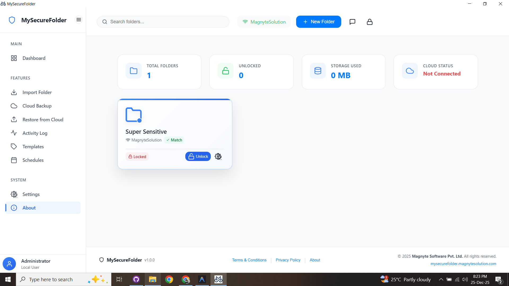
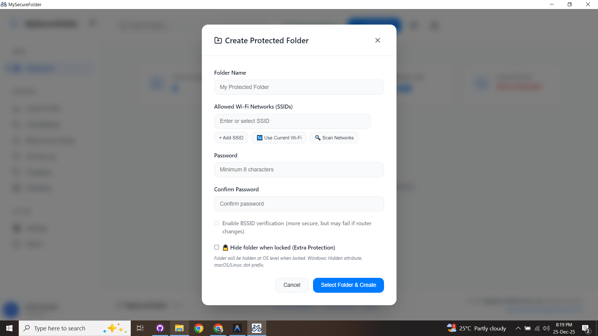
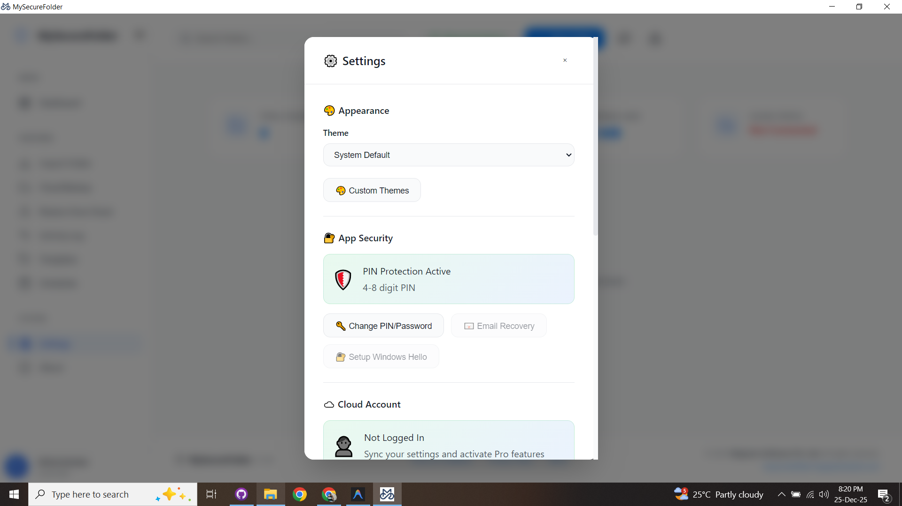
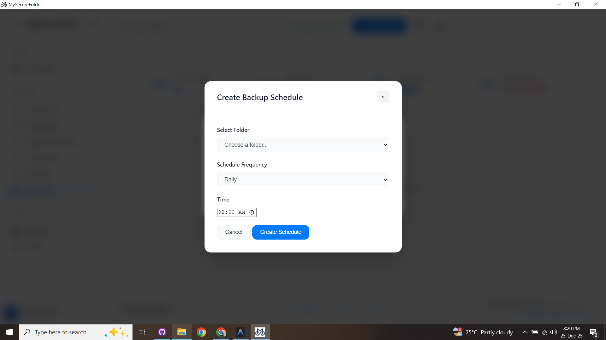

# MySecureFolder

**Enterprise-Focused Desktop Folder Protection for Windows**

MySecureFolder is a Windows desktop application designed to help individuals and organizations protect sensitive folders using strong local encryption combined with configurable access controls and optional cloud-assisted features.

---

## Table of Contents

- Overview
- Key Capabilities
- Editions & Licensing
- Security Model
- System Requirements
- Internet & Account Requirements
- Installation
- Usage Overview
- Privacy & Data Handling
- Limitations
- Roadmap
- Support
- Company Information

---

## Overview

MySecureFolder provides local folder protection for Windows systems by encrypting selected folders and restricting access based on user-defined security policies.

The application is built with a **local-first security approach**, allowing users to protect data offline while offering optional cloud-based functionality for licensing, backups, and multi-device use.

It is suitable for:
- Personal data protection
- Small businesses and teams
- Enterprise environments requiring local file control

---

## Key Capabilities

### Core Security
- Local folder encryption using AES-256-GCM
- Folder visibility control (hidden while locked)
- Application-level authentication (PIN or password)
- Audit logging for access and security events
- Offline folder protection support

### Environment-Aware Access
- Wi-Fi network-based access control (SSID-based)
- Automatic folder locking when leaving trusted networks
- Configurable access rules and policies

### Cloud-Assisted Features (Optional)
- License and settings synchronization
- Encrypted cloud backup and restore
- Cross-device recovery using the same account
- Scheduled automated backups

---

## Editions & Licensing

MySecureFolder is available in the following editions:

### Free
- Local folder encryption
- Application lock
- Wi-Fi network binding
- Audit logs
- Offline usage

### Pro
- License & settings sync
- Encrypted cloud backup
- Cross-device restore
- Scheduled backups

### Pro+
- Windows Hello authentication (hardware-dependent)
- Location-based access rules
- Secure folder sharing
- Custom branding options
- Enhanced network validation

Licensing and feature availability are managed through the MySecureFolder account system.

---

## Pricing & Plan Comparison

### Free  
*Perfect for personal use and getting started with secure folder protection.*

**Price:** ₹0 / month

| Feature | Availability |
|------|-------------|
| Protected Folders | Up to 10 |
| AES-256-GCM Encryption | ✓ |
| Wi-Fi SSID Verification | ✓ |
| Password Protection | ✓ |
| Auto-Lock Functionality | ✓ |
| Proper Folder Hiding (Cloaking) | ✓ |
| Local Backup | ✓ |
| Auto-Update Support | ✓ |
| Community Support | ✓ |
| Email Recovery (SMTP) | ✕ |
| Cloud Backup Storage | ✕ |
| Multi-Device Sync | ✕ |
| Priority Support | ✕ |
| Upgrade Prompts | Periodic |

---

### Pro *(Most Popular)*  
*Advanced security features for power users who need complete protection.*

**Price:** ₹799 / month

| Feature | Availability |
|------|-------------|
| Protected Folders | Up to 80 |
| Everything in Free Plan | ✓ |
| Secure Cloud Backup | 50 GB |
| Automatic Backup Sync | ✓ |
| Scheduled Backups | ✓ |
| File-Level Backup | ✓ |
| Email Recovery (SMTP) | ✓ |
| Activity Logs | 30 Days |
| Audit Logs Export | ✓ |
| Export / Import Folders | ✓ |
| Recovery Key Generation | ✓ |
| Multi-Device Sync | Up to 3 Devices |
| Live Support Chat | ✓ |
| Priority Email Support | ✓ |
| Folder Templates | ✓ |
| File Integrity Monitoring | ✓ |
| Folder Aliases | ✓ |
| Bulk Operations | ✓ |
| Proper Folder Hiding (Cloaking) | ✓ |
| Auto-Update Support | ✓ |
| Upgrade Popups | None |
| Upcoming Features | 2FA, Custom Keys, Cleanup, Compression |

---

### Pro+ *(Best Value)*  
*Ultimate protection with enterprise-grade features and priority support.*

**Price:** ₹1,599 / month

| Feature | Availability |
|------|-------------|
| Protected Folders | Up to 150 |
| Everything in Pro Plan | ✓ |
| Secure Cloud Backup | 500 GB |
| Enhanced BSSID Verification | ✓ |
| Activity Logs | Unlimited |
| Multi-Device Sync | Up to 10 Devices |
| Live Support Chat | 24/7 |
| Advanced Admin Controls | ✓ |
| Folder Sharing & Permissions | ✓ |
| Advanced File Monitoring | ✓ |
| Priority Backup Processing | ✓ |
| Custom Branding | ✓ |
| Geofencing | ✓ |
| Time-Based Access | Coming Soon |
| API Access for Automation | Coming Soon |
| Advanced Encryption Options | Coming Soon |
| Proper Folder Hiding (Cloaking) | ✓ |
| Auto-Update Support | ✓ |

---

**For plan details and registration, visit:**  
👉 https://mysecurefolder.magnytesolution.com

---

## Security Model

- Encryption keys are generated and handled locally
- Protected data is encrypted before any optional backup operation
- Core protection features do not require cloud connectivity
- Cloud services are used only for licensing, synchronization, and backup features

MySecureFolder does not provide default cloud storage unless explicitly enabled by the user.

---

## System Requirements

### Minimum Requirements

- **Operating System:** Windows 10 or Windows 11 (64-bit)
- **Processor:** 1 GHz or faster (dual-core recommended)
- **Memory:** 4 GB RAM or higher
- **Disk Space:** 200 MB for installation (excluding protected data)

---

## Internet & Account Requirements

### Internet Connection Required For
- Initial account registration and login
- License verification
- Cloud backup and restore features

### Account Requirements
- A **Magnyte Cloud Account** is required for login-based and cloud-enabled features
- Email verification is required for account activation and recovery

Account registration:
👉 https://mysecurefolder.magnytesolution.com

Offline folder protection remains available for supported features.

---

## Installation

1. Download the latest Windows installer (`.exe`) from the **Releases** section.
2. Run the installer and complete the setup process.
3. Launch **MySecureFolder** after installation.

---

## Usage Overview

1. Launch MySecureFolder.
2. Configure a local master PIN or password.
3. Sign in with your Magnyte Cloud Account to enable licensed features.
4. Add folders using folder selection.
5. Configure access rules (password, network, or policy-based).
6. Lock and unlock folders as needed.

---

## Screenshots

> Screenshots are provided for demonstration purposes and may vary slightly between versions.

### Dashboard

### Folder Protection

### Security Settings

### Cloud & Backup

---

## Privacy & Data Handling

- User data is stored locally unless cloud features are explicitly enabled
- Encrypted backups remain encrypted during transmission and storage
- Account data is used only for authentication, licensing, and feature management

For detailed information, refer to the Privacy Policy on the official website.

---

## Limitations

- Encrypted data cannot be recovered without proper authentication
- Loss of the master PIN/password may result in permanent data loss
- Some advanced features require active internet connectivity
- Windows Hello availability depends on system hardware support

---

## Roadmap

Planned enhancements include:
- macOS and Linux support
- Expanded enterprise policy controls
- Improved reporting and audit exports
- Additional backup provider integrations

Roadmap items are subject to change.

---

## Support

- Documentation and updates are provided through GitHub
- Issue tracking is available via GitHub Issues
- Account and licensing support is available through the official website

---

## Company Information

**Developed by:**  
**Magnyte Software Pvt. Ltd.**

Website:  
👉 https://mysecurefolder.magnytesolution.com

---

© Magnyte Software Pvt. Ltd. All rights reserved.
